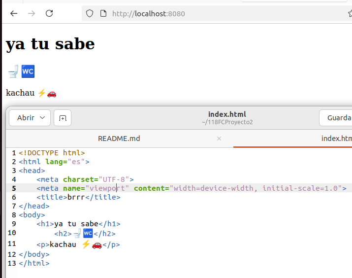
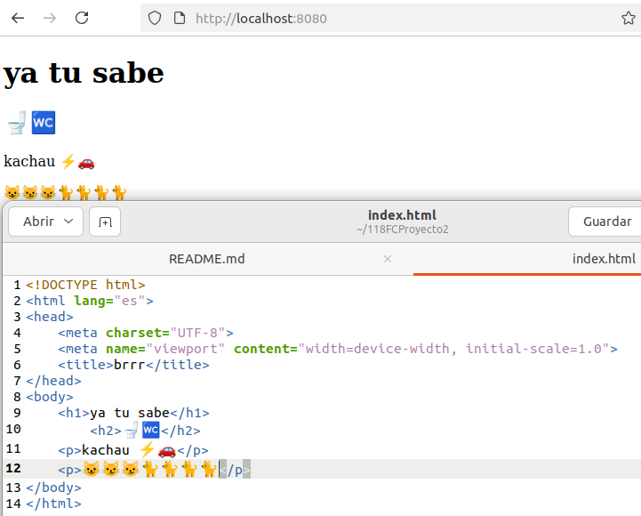

# Fundamentos de contenerización 2 - Modificar un sitio web en ejecución

## Paso 1. Partimos de la imagen construida en la actividad anterior.
[118FCProyecto1](https://github.com/yatusabebeibe/118FCProyecto1)

## Paso 2. Ejecutar el contenedor en el puerto 8080, con el nombre actividad2, es importante montar el directorio actual del host en el directorio /usr/share/nginx/html/ dentro del contenedor. 
```
sudo docker run -d -p 8080:80 --name actividad2 --mount type=bind,source="$(pwd)",target=/usr/share/nginx/html 118fcproyecto1:1.0
```

## Paso 3. Comprobación: http://localhost:8080 

 
## Paso 4. Se pide modificar el fichero index.html desde el host.
(Abrimos el index.html y lo modificamos)

## Paso 5. Se ha producido cambios , http://localhost:8080

